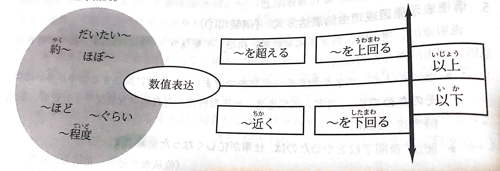

[TOC]

# 表达及词语

## 人称

わたし　あなた　あの人(ひと)（第一课25页）

さん（第一课25页）

公司里 課長(かちょう)/吉田課長(よしだかちょう)/吉田さん(よしださん)（第五课71页）

对方单位 田中課長さん(たなかさん)/社長さん(しゃちょうさん)（第五课71页）

## 省略

第一、第二人称主语的省略（第一课25页）

谓语的省略（第三课45页）

名词的省略（第十课127页）

避免重复谓语的省略（第十一课138页）

1週間(いっしゅうかん)に　2回(にかい) → 週(しゅう)に　2回(にかい)（第十三课163页）

1日(いちにち)に → 日(ひ)に（第十三课163页）

1(い)っか月(げつ)に → 月(つき)に（第十三课163页）

1年(いちねん)に → 年(ねん)に（第十三课163页）

避免重复谓语的省略（第十五课183页）

简体句的省略（第二十二课266页）

### 〜です

部分已经明确的内容，回答别人问题不需要重复时（第五课71页）

替换表示移动的动词（第六课81页）

## 缩略

~って　~と，という人は缩略形式（第三十二课84页）

買(か)っちゃった　是~てしまった的口语形式，令人不愉快的语气较弱（第三十七课146页）

〜，〜，〜，〜と　将〜というように中的いうように省略后的表达方式，列举三个以上的名词或名词句时，用逗号隔开（中级第八课170页）

## 叹词

あっ　是吃惊或者有所感触是发出的声音，人们在紧急情况下一般会情不自禁地发出，自言自语时也用（第一课25页）

えっ　对对方所说的话感到意外或吃惊时使用，也用于没听懂或没明白对方所说的话时的反问（第二课35页）

わあ　感动或者吃惊时发出的声音（第二课35页）

あら　是女性在感到惊讶或疑惑不解时使用的词语（第九课117页）

ああ　对对方的提问或建议做出肯定性回答或者仅仅作为搭腔语使用，比はい、ええ搭腔语气更重（第九课117页）

あれえ　感到吃惊或意外而情不自禁发出的声音，读升调（第十课127页）

さあ　用于向对方提出建议或促使对方做某事，只用于口语（第十八课220页）

へえ　表示对听来的信息感到惊讶或钦佩（第二十七课28页）

うわあ　表示看到某种事物时产生的感动或惊讶（第三十四课109页）

いやあ　主要为男性使用，用于感到不好意思或情绪激动（第四十一课191页）

## 指示上下文内容

こんな    指示上下文（中级第一课29页）

これ、この、このように　指示上下文（中级第四课88页）

それを聞いて　指示上下文内容（中级第五课105页）

あの　指示上下文内容（中级第六课122页）

## 铺垫

が、けど　表示铺垫（中级第三课59页）

突然ですが　表示铺垫（中级第四课77页）

失礼ですが　表示铺垫（中级第九课183页）

よろしければ　表示铺垫，如果没有问题的话，假如没有不方便的话（中级第九课183页）

もしよかったら　表示铺垫，如果可以的话（中级第九课183页）

## 分かる

分かりました　表示同意并接受，自谦：承知(しょうち)しました，电子邮件：了解(りょうかい)しました（中级第四课79页）

## 寒暄语

どうぞ　よろしく　お願いします（第一课25页）

どうも　ありがとう　ございます（第二课36页）

お疲(つか)れ様(さま)でした（第六课82页）

失礼(しつれい)します（第七课91页）

いってらっしゃい　いってまいります/いってきます（第七课92页）

ただいま　お帰(かえ)りなさい（第七课92页）

いらっしゃいませ　かしこまりました（第七课92页）

お邪魔(じゃま)します（第七课92页）

お大事(だいじ)に（第十五课184页）

お世話(せわ)に　なりました/なります（第二十四课285页）

~に　よろしく　お伝(つた)え　ください（第二十四课286页）

お元気(げんき)で（第二十四课286页）

お気(き)お　つけて（第二十四课286页）

お久(ひさ)しぶりです（第三十三课100页）

お元気(げんき)そうで，何(なに)よりです（第三十三课100页）

お待(ま)たせしました　让您久等了（第四十课175页）

## 礼貌语言

人(ひと) → 方(かた)（第二课35页）

询问年龄 何歳(なんさい)ですか → おいくつですか（第二课35页）

询问位置 ここ/そこ/あそこ/どこ → こちら/そちら/あちら/どちら（第三课45页）

询问国家 お国(くに)は　どちらですか（第三课45页）

询问公司 会社(かいしゃ)は　どちらですか（第三课45页）

询问家人 ご家族(かぞく)　ご兄弟(きょうだい)　ご両親(りょうしん)（第四课55页）

## 搭话

あのう　用于向对方搭话或欲引起对方注意，在说到难以启齿的事情、开始一个新话题以及向别人提出请求时也可以用（第三课46页）

すみません　请问，劳驾（第七课92页）

すみませんが，〜　麻烦你，不好意思，表示因占用对方时间而感到过意不去（第十四课174页）

すみません，~/あのう/ちょっと/失礼ですが，~　搭话，打招呼比较（中级第一课16页）

## 思考

ええと　被别人问及某事，思考该如何回答时说的话（第四课55页）

## 确认

〜ですか　用于进一步确认对方所说的信息，句尾读升调；在对方所说的内容后加か重复一遍，表示理解了对方所说的内容，句尾读降调（第三课46页）

ね    说话人觉得双方意见一致，征求听话人的同意，读升调（第四课54页）

小句(简体形)でしょう？    确认，确认对方比自己熟悉的事情，有请听话人告诉自己某种信息的语感，读升调；对方和自己意见不同，或叮问对方，读降调，简体为だろう（第二十六课16页）

そうですか　应答时经常用，读降调，表示理解了所听到的新信息（第七课91页）

## 提醒

よ　用于提醒对方注意其不知道、不了解的事情，读升调，可表示告知、提醒、轻微的警告等（第八课100页）

## 提议

ましょうか（第二十一课254页）

## 请求

お願いします（第八课102页）

〜て　くださいませんか（第十四课174页）

〜て　いただけますか/いただけませんか（第四十八课266页）

## 推测

小句(简体形)でしょう    推测，表示说话人对自己喝听话人都不能断定的事情进行推测，>50%，简体为だろう（第二十六课16页）

## 传闻

~って　传闻（第二十二课265页）

小句(简体形)そうです    表示从别人那里听到的，提示消息来源时用によると（第三十二课82页）

## 期间

ずっと　表示在某一期限内动作、状态一直持续（第三十二课83页）

## 对他人愿望

~てほしい　表示希望别人去做某事，不能对长辈或上级使用（第三十二课84页）

## ~って

~って　传闻（第二十二课265页）

~って　~と，という人は缩略形式（第三十二课84页）

## 数字读法

| 读法 | 数字 |
| --- | --- |
| しち　く | 7点 9点 |
| | 17日 19日 |
| | 27日 29日 |
| | 7月 9月 |
| よ | 4点 |
| し | 4月 |
| よん　なな　きゅう | 40 70 90 |
| | 400 700 900 |
| | 4000 7000 9000 |
| | 4分 7分 9分 |

## 数字

| 日 | | 日 | | 日 | | 点 | | 月 | | 分 | | 十 | | 百 | ひゃく | 千 | せん | other |  |
| --- | --- | --- | --- | --- | --- | --- | --- | --- | --- | --- | --- | --- | --- | --- | --- | --- | --- | --- | --- |
| 1日 | ついたち | 11日 | じゅういちにち | 21日 | にじゅういちにち | 1点 | いちじ | 1月 | いちがつ | 1分 | いっぷん | 10 | じゅう | 100 | ひゃく | 1000 | せん | 10000 | いちまん |
| 2日 | ふつか | 12日 | じゅうににち | 22日 | にじゅうににち | 2点 | にじ | 2月 | にがつ | 2分 | にふん | 20 | にじゅう | 200 | にひゃく | 2000 | にせん | 100000 | じゅうまん |
| 3日 | みっか | 13日 | じゅうさんにち | 23日 | にじゅうさんにち | 3点 | さんじ | 3月 | さんがつ | 3分 | さんぷん | 30 | さんじゅう | 300 | さんびゃく | 3000 | さんぜん | 1000000 | ひゃくまん |
| 4日 | よっか | 14日 | じゅうよっか | 24日 | にじゅうよっか | 4点 | よじ | 4月 | しがつ | 4分 | よんぷん | 40 | よんじゅう | 400 | よんひゃく | 4000 | よんせん | 10000000 | いっせんまん |
| 5日 | いつか | 15日 | じゅうごにち | 25日 | にじゅうごにち | 5点 | ごじ | 5月 | ごがつ | 5分 | ごふん | 50 | ごじゅう | 500 | ごひゃく | 5000 | ごせん | 100000000 | いちおく |
| 6日 | むいか | 16日 | じゅうろくにち | 26日 | にじゅうろくにち | 6点 | ろくじ | 6月 | ろくがつ | 6分 | ろっぷん | 60 | ろくじゅう | 600 | ろっぴゃく | 6000 | ろくせん | 9002 | きゅうせんに |
| 7日 | なのか | 17日 | じゅうしちにち | 27日 | にじゅうしちにち | 7点 | しちじ | 7月 | しちがつ | 7分 | ななふん | 70 | ななじゅう | 700 | ななひゃく | 7000 | ななせん | 9020 | きゅうせんにじゅう |
| 8日 | ようか | 18日 | じゅうはちにち | 28日 | にじゅうはちにち | 8点 | はちじ | 8月 | はちがつ | 8分 | はっぷん | 80 | はちじゅう | 800 | はっぴゃく | 8000 | はっせん | 9200 | きゅうせんにひゃく |
| 9日 | ここのか | 19日 | じゅうくにち | 29日 | にじゅうくにち | 9点 | くじ | 9月 | くがつ | 9分 | きゅうふん | 90 | きゅうじゅう | 900 | きゅうひゃく | 9000 | きゅうせん |
| 10日 | とおか | 20日 | はつか | 30日 | さんじゅうにち | 10点 | じゅうじ | 10月 | じゅうがつ | 10分 | じゅっぷん |
| | | | | 31日 | さんじゅういちにち | 11点 | じゅういちじ | 11月 | じゅういちがつ | 11分 | じゅういっぷん |
| | | | | 几日 | なんにち | 12点 | じゅうにじ | 12月 | じゅうにがつ | 15分 | じゅうごふん |
| | | | | | | 0点 | れいじ | 几月 | なんがつ | 30分 | さんじゅっぷん/はん |
| | | | | | | 几点 | なんじ | | |  45分 | よんじゅうごふん |
| | | | | | | | | | | 几分 | なんぷん |

## 数值表达方式

## 日历

| 日曜日にちようび | 月曜日げつようび | 火曜日かようび | 水曜日すいようび | 木曜日もくようび | 金曜日きんようび | 土曜日どようび |
| --- | --- | --- | --- | --- | --- | --- |
| 1 | 2 | 3 | 4 | 5 | 6 | 7 |
| ついたち | ふつか | みっか | よっか | いつか | むいか | なのか |
| 8 | 9 | 10 | 11 | 12 | 13 | 14 |
| ようか | ここのか | とおか | じゅういちにち | じゅうににち | じゅうさんにち | じゅうよっか |
| 15 | 16 | 17 | 18 | 19 | 20 | 21 |
| じゅうごにち | じゅうろくにち | じゅうしちにち | じゅうはちにち | じゅうくにち | はつか | にじゅういちにち |
| 22 | 23 | 24 | 25 | 26 | 27 | 28 |
| にじゅうににち | にじゅうさんにち | にじゅうよっか | にじゅうごにち | にじゅうろくにち | にじゅうしちにち | にじゅうはちにち |
| 29 | 30 | 31 |
| にじゅうくにち | さんじゅうにち | さんじゅういちにち |

## 表示时间的词语

| 天 | | 早晨 | | 晚上 | | 星期 | | 月 | | 年 | |
| --- | --- | --- | --- | --- | --- | --- | --- | --- | --- | --- | --- |
| 前天 | おととい | 前天早晨 | おとといの朝(あさ) | 前天晚上 | おとといの晩(ばん) | 上上个星期 | 先々週(せんせんしゅう) | 上上个月 | 先々月(せんせんげつ) | 前年 | おととし |
| 昨天 | 昨日(きのう) | 昨天早晨 | 昨日(きのう)の朝(あさ) | 昨天晚上 | 昨夜(ゆうべ) | 上个星期 | 先週(せんしゅう) | 上个月 | 先月(せんげつ) | 去年 | 去年(きょねん) |
| 今天 | 今日(きょう) | 今天早上 | 今朝(けさ) | 今天晚上 | 今晩(こんばん) | 这个星期 | 今週(こんしゅう) | 这个月 | 今月(こんげつ) | 今年 | 今年(ことし) |
| 明天 | 明日(あした) | 明天早晨 | 明日(あした)の朝(あさ) | 明天晚上 | 明日(あした)の晩(ばん) | 下个星期 | 来週(らいしゅう) | 下个月 | 来月(らいげつ) | 明年 | 来年(らいねん) |
| 后天 | あさって | 后天早晨 |あさっての朝(あさ) | 后天晚上 | あさっての晩(ばん) | 下下个星期 | さ来週(らいしゅう) | 下下个月 | さ来月(らいげつ) | 后年 | さ来年(らいねん) |
| 每天 | 毎日(まいにち) | 每天早上 | 毎朝(まいあさ) | 每天晚上 | 毎晩(まいばん) | 每个星期 | 毎週(まいしゅう) | 每个月 | 毎月(まいつき) | 每年 | 毎年(まいとし) |

## 中

世界中(せかいじゅう)　"[场所]+中"表示其场所范围内的全部，"[时间/期间]+中"时用"一~中"，表示在某个期间一直（第十课127页）

| [场所]+中(じゅう) | [时间/期间]+中(じゅう) |
| --- | --- |
| 世界中(せかいじゅう) | 一日中(いちにちじゅう) |
| 日本中(にほんじゅう) | 一晩中(ひとばんじゅう) |
| 学校中(がっこうじゅう) | 一年中(いちねんじゅう) |

今年中(ことしじゅう)に　表示该期间结束之前（第十七课209页）

| 中(じゅう) | 中(ちゅう) |
| --- | --- |
| 今年中(ことしじゅう)に | 来週中(らいしゅうちゅう)に |
| 今日中(きょうじゅう)に | 四月中(しがつちゅう)に |
| 明日中(あしたじゅう)に | 来月中(らいげつちゅう)に |

出張中(しゅっちょうちゅう)　某个动作正在进行，中读ちゅう，一二类动词去掉ます形，三类动词去掉します（第二十四课286页）

## 先(さき)

| ~先(さき) | 到达地点或归属 |
| --- | --- |
| 行き先 | 目的地，要去的地方 |
| 旅行先 | 旅行的目的地 |
| 出張先 | 出差所去的地方 |
| 就職先 | 就业的单位 |
| 送り先 | 邮件的接受人和地方 |

## 费用

## 指人的词

あれ　礼貌程度低（第二十五课7页）

